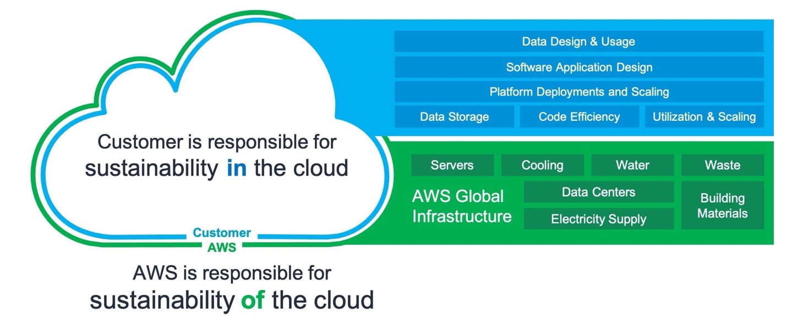

# What Is AWS Well-Architected?

AWS Well-Architected is a framework that helps you refine and improve your architecture practices when using AWS. The framework was designed to help companies better understand how to make the most of AWS’s capabilities, optimize their costs, and improve the performance of their applications.

AWS Well-Architected is based on six pillars – operational excellence, security, reliability, performance efficiency, cost optimization and sustainability. Each pillar contains a set of architectural best practices that should be followed when using AWS.

In this article, we will take a closer look at each of the six pillars and explain why they are important for your AWS architecture.

## Well-Architected Operational Excellence Pillar

The Operational Excellence pillar of the AWS Well-Architected Framework helps you maintain continuous improvement practices in your AWS environment. This includes identifying and addressing areas of improvement, automating tasks to improve efficiency, and monitoring your AWS environment to identify issues early.

In order to continuously improve your AWS environment, you should:
- Regularly review your architecture and identify areas of improvement
- Automate tasks to improve efficiency
- Monitor your AWS environment for issues

We will talk about this pillar in more detail in the next steps of our Journey.

## Well-Architected Security Pillar
Security is built into every aspect of the AWS cloud; it’s not an afterthought. The security pillar covers best practices for securely architecting your AWS solution, including how to protect data at rest and in motion, how to keep your systems up to date with patches and software updates, and how to use multi-factor authentication (MFA) with administrative accounts.

We will talk about this pillar in more detail in the next steps of our Journey.

## Well-Architected Reliability Pillar
The Well-Architected Reliability pillar includes recommendations for designing highly available applications and services that can tolerate failures in the event of an outage. The key goal is to ensure that your application is able to recover from failures quickly and with minimal impact to end users.
- Automatically recover from failure
- Test recovery procedures
- Scale horizontally to increase aggregate workload availability
- Stop guessing capacity
- Manage change in automation

## Well-Architected Performance Efficiency Pillar
This pillar focuses on structured and streamlined allocation of IT and computing resources. Key topics include selecting resource types and sizes optimized for workload requirements, monitoring performance, and maintaining efficiency as business needs evolve.

## Cost Optimization
The cost optimization pillar is concerned with avoiding unnecessary expenses. Understanding spending over time and controlling fund allocation are key topics, as are selecting the right type and quantity of resources, and scaling to meet business needs without overspending.

This pillar consists of these principles:

- Implement cloud financial management
- Adopt a consumption model
- Measure overall efficiency
- Stop spending money on undifferentiated heavy lifting
- Analyze and attribute expenditure

We will talk about this pillar in detail, later.

## Sustainability Optimization

The sustainability pillar aims to reduce the environmental impact of cloud workloads.

A shared responsibility model for sustainability, understanding impact, and maximizing utilization are key topics.

> Environmental sustainability is a shared responsibility between
> customers and AWS.
>
> -   AWS is responsible for optimizing the sustainability  _of_  the cloud – delivering efficient, shared infrastructure, water
      > stewardship, and sourcing renewable power.
>
> -   Customers are responsible for sustainability  _in_  the cloud – optimizing workloads and resource utilization, and minimizing the
      > total resources required to be deployed for your workloads.
>
> https://docs.aws.amazon.com/wellarchitected/latest/sustainability-pillar/the-shared-responsibility-model.html
